# **About arc42**

arc42, the template for documentation of software and system architecture.

Template Version 8.1 EN. (based upon AsciiDoc version), May 2022

Created, maintained, and © by Dr. Peter Hruschka, Dr. Gernot Starke, and contributors.
See <[https://arc42.org](https://arc42.org)

# **Introduction and Goals**

This document describes the Wallet Stub, which is used to replace some functionalities of a real wallet implementation.
It provides a set of mocked Restful API resources that can be used for testing and development purposes.

### **Initial Situation from Business View**

Currently, the SSI Credential Issuer component depends on a configured wallet in order to start running and execute a
sequence of steps to issue or revoke a credential. As the usage of a real wallet is not always possible and the
component has to be tested, it became essential to create a stub wallet allowing the component to execute required API
calls.

There are similar dependencies of Portal and the EDC with the wallet component, and those dependencies also have to be
addressed with the stub wallet for E2E and integration test while preparing the new landing zones for the release 24.05.

The following goes have been established for the Wallet Stub:

| **Functionality** | **Description**                                                                                                                                                                                                                               |
|-------------------|-----------------------------------------------------------------------------------------------------------------------------------------------------------------------------------------------------------------------------------------------|
| Wallet            | Creation of mocked resources for the following endpoints:<br><br>*   /credentials \[Post\]<br>    <br>*   /credentials/{credentialId} \[Patch, GET\]<br>    <br><br>These endpoints are used to create, sign, store, and revoke a credential. |
| DID               | Creation of mocked resources for the following endpoints:<br><br>*   /{bpn}/did.json \[GET\]                                                                                                                                                  |
| Portal            | Creation of mocked resources for the following endpoints:<br><br>*   /dim/setup-dim \[Post\]<br>    <br>*   /dim/technical-user/{bpn} \[Post\]                                                                                                |
| Token             | Creation of mocked resources for the following endpoints:<br><br>*   /oauth/token \[Post\]                                                                                                                                                    |
| EDC               | Creation of mocked resources for the following endpoints:<br><br>*   /api/sts \[Post\]<br>    <br>*   /api/presentations/query \[Post\]                                                                                                       |

### Core Functionalities

1. Create, sign, store, revoke, and get credential

2. Request DID document

3. Create tech user

4. Request Status List

5. Create access token, Create token with and without scope

6. Request Verifiable Presentations

7. Get BPN did mappings

### Integration Goals

The wallet stub service is independent of any other service. The primary goal is that all components and systems can
interact with the wallet stub and simulate the required resources. DevOps teams, developers and testers can make use of
it in order to validate environments that depend on such service.

### **Cross-cutting Concepts**

**Service stubs:** Service stubs are simulations of an actual service, which can be used to functionally replace the
service in a test environment. A stub server replaces the actual application server.

From the point of view of the client application, the service stub looks identical to the actual service that it
simulates. To use a service stub in replacement of the actual service, you must be able to replace the URL of the
original service in the client application with the URL of the stub server.

**Mocks:** programmable interface observers, that verifies outputs against expectations defined by the test. It is
frequently created using a third party library, for example in Java that is Mockito, JMock or WireMock.

**Virtual service:** a test double often provided as a Software-as-a-Service (SaaS), is always called remotely, and is
never working in-process directly with methods or functions. A virtual service is often created by recording traffic
using one of the service virtualization platforms instead of building the interaction pattern from scratch based on
interface or API documentation.

### **Business Solution Target Group**

1. Portal

2. Issuer Component

3. EDC

### **Challenges**

* **Unknown full scope**: The full scope of the expectations from the stub service is at this point unclear. So far the
  minimum requirement to address is enabling the dependent microservices to deploy and pass the E2E tests. However, the
  business logic of multiple services outside of this scope might be too complex and error-prone for simulation. We have
  to define a minimum viable stub and continue delivering if there is any necessity or further requirement. Currently
  only `type:MembershipCredential`, `type:BPNCredential` and `type:DataExchangeGovernanceCredential` are supported.

* **Security:** Security features such as authentication, authorization, and data encryption must also be simulated with
  the stub service.

* **Case coverage:** The stub service must pass comprehensive test coverage across all microservices, excluding edge
  cases and “not happy” scenarios.

* **Data Consistency:** Deployment of dependent microservices is persistent, and they keep logs and DB entries. The
  returns of the stub service must be consistent, disregarding the overall software component architecture (i.e., design
  choices around in-memory vs database), even when the stub service has to restart.

* **Maintenance:** The service must be maintained with further breaking changes to the wallet service. In the near
  future, those include the DCP issuance flow implementation.

### **Benefit Hypothesis & Problem Statement**

Benefits of the stub service are:

* Fully managed and maintained by Open source community

* Eclipse tractus-X can deploy the microservices that depends on a wallet to be deployed

* Deployed microservices can be tested with the wallet stub

### **Requirements Overview**

After the deployment of this service, the below requirements shall be fulfilled:

1. Creation of a wallet (Portal)

2. Request a DID document (Portal)

3. Create, sign, store, get, and revoke a credential (Issuer Component)

4. Token creation (EDC / …)

5. Request for a status list (EDC/BDRS)

6. Create a tech user (Portal)

7. Create Verifiable Presentation (EDC)

8. Get BPN did mappings (EDC/BDRS)

The service contains a set of mocked resources that simulate all above requirements. All of them must succeed when
requested. At the moment simulation of errors are partially covered.

**Quality Goals**

1. All endpoints can be successfully executed

2. No errors are expected

3. Sonar Quality Gate should be passed

4. No issues in code scanning (Trivy/Vera)

5. Unit test coverage shall be more than 80%

**Quality Tree**
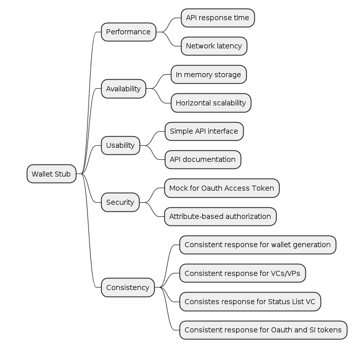

<details>
  <summary>Plant UML</summary>

  ```plantuml
  @startmindmap
*Wallet Stub
** Performance
*** API response time
*** Network latency
** Availability
*** In memory storage
*** Horizontal scalability
** Usability
*** Simple API interface
*** API documentation
** Security
*** Mock for Oauth Access Token
*** Attribute-based authorization
** Consistency
*** Consistent response for wallet generation
*** Consistent response for VCs/VPs
*** Consistent response for Status List VC
*** Consistent response for Oauth and SI tokens
@endmindmap
  ```

</details>

### **Stakeholders**

* **Development Team:** Responsible for implementing the integration.

* **Security Team:** Ensures the security of the key management solution.

* **Operations Team:** Manages the deployment and ongoing operation of the integrated system.

### **Architecture Constraints**

* The wallet stub can be deployed as a docker image, e.g., on Kubernetes (platform-independent, cloud, on-premise, or
  local)

* It should be horizontally scalable

* Data will be stored in-memory storage. However, each time when a VP request is made, a VC is created as well. The
  persistence of signing keys is achieved via creating the keys with seeds derived from the BPN or the issuer and
  holder.

* Token based authentication - there will be no roles assigned for the tokens but each token is unique due to
  differentiation with BPN and issuance date and expiry date. Tokens can be generated on demand.

* Only happy cases are covered - there will be no stubbing for unhappy cases

### **Roles Rights Management**

Token based authentication - for each BPN a different OAuth token can be created on
demand (`clientId and secret == BPN`).

### Use case diagram:

**Note:** Create wallet also creates technical user. Mention it during the API spec. Revocation is mock only it doesn’t
change the status but deliver success message back to issuer component.

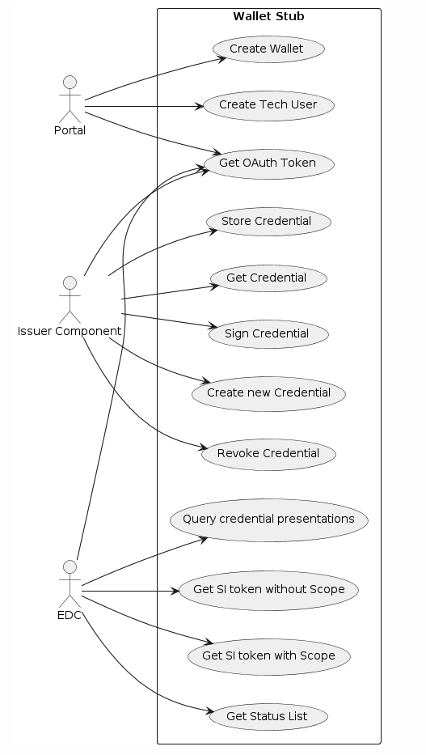

<details>
  <summary>Plant UML</summary>

  ```plantuml
  @startuml
left to right direction
actor "Portal" as portal
actor "Issuer Component" as issuer
actor "EDC" as edc

rectangle "Wallet Stub" {
  usecase "Create Tech User" as UC1
  usecase "Create Wallet" as UC2
  usecase "Create new Credential" as UC3
  usecase "Sign Credential" as UC11
  usecase "Get Credential" as UC12
  usecase "Store Credential" as UC4
  usecase "Revoke Credential" as UC5
  usecase "Get Status List" as UC6
  usecase "Get OAuth Token" as UC7
  usecase "Get SI token with Scope" as UC8
  usecase "Get SI token without Scope" as UC9
  usecase "Query credential presentations" as UC10
}
portal --> UC1
portal --> UC2
issuer --> UC3
issuer --> UC11
issuer --> UC12
issuer --> UC4
issuer --> UC5
issuer --> UC7
portal --> UC7
edc --> UC6
edc --> UC7
edc --> UC8
edc --> UC9
edc --> UC10
@enduml
  ```

</details>

# **System Scope and Context**

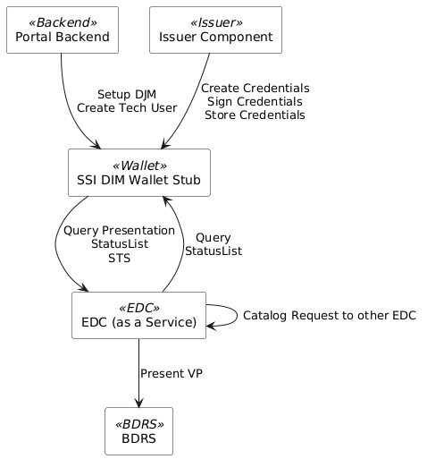

<details>
  <summary>Plant UML</summary>

  ```plantuml
@startuml
!define RECTANGLE_ANTIALIASED true
skinparam defaultFontName Arial
skinparam rectangle {
  BackgroundColor<< Backend >> White
  BackgroundColor<< Issuer >> White
  BackgroundColor<< Wallet >> White
  BackgroundColor<< EDC >> White
  BackgroundColor<< BDRS >> White
}

rectangle "Portal Backend" << Backend >> as PortalBackend
rectangle "Issuer Component" << Issuer >> as IssuerComponent
rectangle "SSI DIM Wallet Stub" << Wallet >> as WalletStub
rectangle "EDC (as a Service)" << EDC >> as EDCService
rectangle "BDRS" << BDRS >> as BDRSService

PortalBackend --> WalletStub : Setup DJM\nCreate Tech User
IssuerComponent --> WalletStub : Create Credentials\nSign Credentials\nStore Credentials
WalletStub --> EDCService : Query Presentation\nStatusList\nSTS
EDCService --> WalletStub : Query\nStatusList
EDCService --> BDRSService : Present VP
EDCService --> EDCService : Catalog Request to other EDC
@enduml
  ```

</details>


## **Business Context**

1. Portal <> Wallet Stub:

    1. CX-Operator onboards business partner that will create a wallet for them. It automatically creates a tech user in
       return.

    2. CX-Operator creates optionally (and additionally) technical user without creating a new wallet.

    3. CX-Operator (Frontend) can revoke a credential. A success post will return without changing the Status List VC (
       static)

2. Issuer Component <> Wallet Stub:

    1. CX-Operator creates a new credential template related to a business partner. It returns a credentialID.

    2. CX-Operator requests signature for a credentialID. Signed credential is returned.

    3. CX-Operator requests storage of the signed credential in the corresponding wallet.

3. EDC <> Wallet Stub:

    1. EDC requests creation of an SI token with Scope to use it for itself, i.e., accessing BDRS with Membership VP.

    2. EDC (Data Provider) requests creation of an SI token without Scope using the access token from STS (Data
       Consumer) to share with another EDC (Data Consumer), i.e., for catalog request.

    3. Any EDC requests creation of a VP using either SI token with or without Scope for the above-mentioned use cases.

    4. EDC / BDRS requests VC Status List from the issuer wallet.

    5. EDC Request for BPN Did mapping using directory API


## **Technical Context**

| **Topic**       | **Tech. stack**                                                                                                                                                   |
|-----------------|-------------------------------------------------------------------------------------------------------------------------------------------------------------------|
| Backend         | Java version 17 with Sprint Boot 3.2.6                                                                                                                            |
| Storage         | In-Memory                                                                                                                                                         |
| Role Management | Token-based (JWT), attribute-based (BPN)                                                                                                                          |
| DevOps          | Docker, ArgoCD, Kubernetes                                                                                                                                        |
| Infra           | SonarCloud, Trivy Scan                                                                                                                                            |
| Version Control | GitHub                                                                                                                                                            |
| Other Lib       | Swagger Open API, SSI Agent, Lombok, org.eclipse.edc:verifiable-credentials-api:0.7.0,  org.eclipse.edc:identity-trust-sts-api, org.eclipse.edc:crypto-common-lib |

# **Interfaces**

Wallet stub service offers external interfaces for issuer component, portal, and EDC.

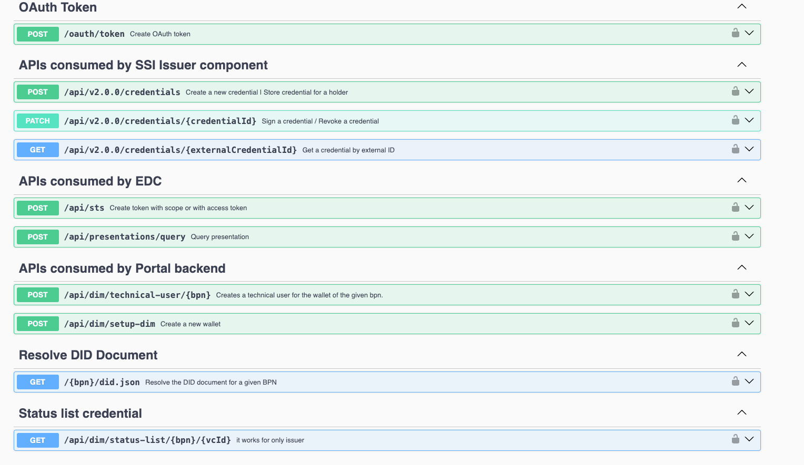

**POST Token**

Create OAuth token to access wallet APIs.

Request Body:

```shell
curl --location 'http://localhost:8080/oauth/token' \
--header 'accept: application/json' \
--header 'Content-Type: application/x-www-form-urlencoded' \
--data-urlencode 'client_id=BPNL000000000000' \
--data-urlencode 'client_secret=BPNL000000000000' \
--data-urlencode 'grant_type=string'
```

Response Body:

```json
{
    "access_token": "JWT",
    "token_type": "Bearer",
    "expires_in": "int",
    "refresh_expires_in": "int",
    "not-before-policy": "int",
    "scope": "string"
}
```

### POST Setup Dim - Portal


This API is used to create a wallet and DID document. It waits for 60 seconds before creating the tech user.
Currently `externalId == BPN` but if the wallet stub is connected to a Keycloak, an `externalId` from Keycloak can be
passed to order the BPN.

Request Parameter:

```
"companyName": "string"
"bpn": "string"
"didDocumentLocation": "string"
```

Response Body:
201 Success with no content

After 60 second Stub app will call portal-backend `/api/administration/registration/dim/{bpn}`

Request Parameter:

```json
{
    "did": "did:web:localhost:BPNL000000000000",
    "didDocument": {
        "service": [
            {
                "id": "http://localhost#credential-service",
                "type": "CredentialService",
                "serviceEndpoint": "http://localhost/api"
            }
        ],
        "verificationMethod": [
            {
                "id": "did:web:localhost:BPNL000000000000#c3932ff5-8da4-3de9-a942-62125f394e41",
                "type": "JsonWebKey2020",
                "controller": "did:web:localhost:BPNL000000000000",
                "publicKeyJwk": {
                    "kty": "EC",
                    "use": "sig",
                    "crv": "secp256k1",
                    "x": "NytYgtL_rte4EIXpb46e7pntJiPjH4l_pN1j1PVxkO8",
                    "y": "99JkYiCOkBfb8qCncv_YWdHy3eZGAQojWbmaEDFwSlU"
                }
            }
        ],
        "authentication": [
            "did:web:localhost:BPNL000000000000#c3932ff5-8da4-3de9-a942-62125f394e41"
        ],
        "id": "did:web:localhost:BPNL000000000000",
        "@context": [
            "https://www.w3.org/ns/did/v1"
        ]
    },
    "authenticationDetails": {
        "authenticationServiceUrl": "http://localhost/oauth/token",
        "clientSecret": "BPNL000000000000",
        "clientID": "BPNL000000000000"
    }
}
````

Response Body:
200 Success with no content

### POST Create Technical User - Portal


This API creates a tech user for an existing BPN. It also can take `externalId` and `name` as request body to order the
tech user for Keycloak.

Request Parameter:

```
"bpn": "string"
```

Request Body:

```json
{
    "externalId": "string",
    "name": "string"
}
```

Response Body:

200 OK

After 60 second Stub app will call
portal-backend [callback url](/api/administration/serviceAccount/callback/{externalId})

Request Parameter:

```
{
    "authenticationServiceUrl": "stubHost/api/token",
    "clientId": "string", //--> currently BPN
    "clientSecret": "string" //--> currentlyBPN
}
```

Response Body:
200 Success with no content

### POST Credentials - Issuer Component


Can be used for creating a credential (without signing) and if it is a signed credential, it is used to store the
credential in the corresponding wallet. The business logic depends on the request body.

**Create New Credential**

The following request body results in creating a credential and returns a `credentialID` as a response.

Request Body:

```json
{
    "application": "catena-x",
    "payload": {
        "issue": {
            "@context": [
                "https://www.w3.org/2018/credentials/v1",
                "https://catenax-ng.github.io/product-core-schemas/businessPartnerData.json",
                "https://w3id.org/security/suites/jws-2020/v1"
            ],
            "id": "did:web:localhost:BPNL000000000000#a1f8ae36-9919-4ed8-8546-535280acc5bf",
            "type": [
                "VerifiableCredential",
                "BpnCredential"
            ],
            "issuer": "did:web:localhost:BPNL000000000000",
            "issuanceDate": "2023-07-19T09:14:45Z",
            "expirationDate": "2023-09-30T18:30:00Z",
            "credentialSubject": {
                "bpn": "BPNL000000000001",
                "id": "did:web:localhost:BPNL000000000001",
                "type": "BpnCredential"
            }
        }
    }
}
```

Response Body:

200 Success

```json
{
    "id": "string"
}
```

**Store Credential for Holder**

The following request body results in storing a signed Verifiable Credential for the holder of the VC. It returns
a `credentialId` as a response.

Request Body:

```json
{
    "application": "catena-x-portal",
    "payload": {
        "derive": {
            "verifiableCredential": "eyJraWQiOiJkaWQ6d2ViOnNvbWUtaXNzdWVyI2tleS0xIiwiYWxnIjoiRVMyNTYifQ.eyJzdWIiOiJkZWdyZWVTdWIiLCJhdWQiOiJkaWQ6d2ViOmJkcnMtY2xpZW50IiwibmJmIjoxNzE4MzQzOTAzLCJpc3MiOiJkaWQ6d2ViOnNvbWUtaXNzdWVyIiwiZXhwIjoxNzE4MzQzOTYzLCJpYXQiOjE3MTgzNDM5MDMsInZjIjp7IkBjb250ZXh0IjpbImh0dHBzOi8vd3d3LnczLm9yZy8yMDE4L2NyZWRlbnRpYWxzL3YxIiwiaHR0cHM6Ly93M2lkLm9yZy9jYXRlbmF4L2NyZWRlbnRpYWxzL3YxLjAuMCJdLCJpZCI6IjFmMzZhZjU4LTBmYzAtNGIyNC05YjFjLWUzN2Q1OTY2ODA4OSIsInR5cGUiOlsiVmVyaWZpYWJsZUNyZWRlbnRpYWwiLCJNZW1iZXJzaGlwQ3JlZGVudGlhbCJdLCJpc3N1ZXIiOiJkaWQ6d2ViOmNvbS5leGFtcGxlLmlzc3VlciIsImlzc3VhbmNlRGF0ZSI6IjIwMjEtMDYtMTZUMTg6NTY6NTlaIiwiZXhwaXJhdGlvbkRhdGUiOiIyMDk5LTA2LTE2VDE4OjU2OjU5WiIsImNyZWRlbnRpYWxTdWJqZWN0Ijp7ImlkIjoiZGlkOndlYjpiZHJzLWNsaWVudCIsImhvbGRlcklkZW50aWZpZXIiOiJCUE5MMDAwMDAwMDAxIn19LCJqdGkiOiJlZDlhNjhkMS0yZjFkLTQxZjgtYWUwOS1hNDBhMTA2OTUwMTUifQ.tdLmrcQpGH-SGBpRpRmFX4AXQJx99uUhDOwuGtSejWkkQ2N_yNtEsoP93xDuBod_AY7zVqY4P_Ofdz-H4zE6nw"
        }
    }
}
```

Response Body:
200 OK

```json
{
    "id": "string"
}
```

### PATCH Credentials - Issuer Component


For signing and revoking (depending on the query parameter / request body)

**Sign Credential**

The following query parameter and request body results in signing a credential and making it a Verifiable Credential.

Query Parameter:

```
"credentialId": "string"
```

Request Body:

```json
{
    "sign": {
        "proofMechanism": "external",
        "proofType": "jwt"
    }
}
```

Response Body:

200 OK

```json
{
    "jwt": "string"
}
```

**Revoke Credential**

The following query parameter and request body results in revoking a VC

Query Parameter:

```
"credentialId": "string"
```

Request Body:

```json
{
    "payload": {
        "revoke": true
    }
}
```

Response Body:

200 OK

### GET Credentials - Issuer Component


This API results in getting a VC by `credentialId`.

Query Parameter:

```
"externalCredentialId": "string"
```

Response Body:

200 OK

```json
{
    "verifiableCredential": "eyJraWQiOiJkaWQ6d2ViOmxvY2FsaG9zdDpCUE5MMDAwMDAwMDAwMDAwI2MzOTMyZmY1LThkYTQtM2RlOS1hOTQyLTYyMTI1ZjM5NGU0MSIsInR5cCI6IkpXVCIsImFsZyI6IkVTMjU2SyJ9.eyJhdWQiOlsiZGlkOndlYjpsb2NhbGhvc3Q6QlBOTDAwMDAwMDAwMDAwMCIsImRpZDp3ZWI6bG9jYWxob3N0OkJQTkwwMDAwMDAwMDAwMDEiXSwiYnBuIjoiQlBOTDAwMDAwMDAwMDAwMSIsInN1YiI6ImRpZDp3ZWI6bG9jYWxob3N0OkJQTkwwMDAwMDAwMDAwMDAiLCJpc3MiOiJkaWQ6d2ViOmxvY2FsaG9zdDpCUE5MMDAwMDAwMDAwMDAwIiwiZXhwIjoxNzE5ODA5NTQ1LCJpYXQiOjE3MTk4MDkyNDUsInZjIjp7Imlzc3VhbmNlRGF0ZSI6IjIwMjMtMDctMTlUMDk6MTQ6NDVaIiwiY3JlZGVudGlhbFN1YmplY3QiOnsiYnBuIjoiQlBOTDAwMDAwMDAwMDAwMSIsImlkIjoiZGlkOndlYjpsb2NhbGhvc3Q6QlBOTDAwMDAwMDAwMDAwMSIsInR5cGUiOiJCcG5DcmVkZW50aWFsIn0sImlkIjoiZGlkOndlYjpsb2NhbGhvc3Q6QlBOTDAwMDAwMDAwMDAwMCMxOWNiNjU2Mi1iYWM3LTNkYzMtYWFmNi00NjEyZTM0OWEwMTEiLCJ0eXBlIjpbIlZlcmlmaWFibGVDcmVkZW50aWFsIiwiQnBuQ3JlZGVudGlhbCJdLCJAY29udGV4dCI6WyJodHRwczovL3d3dy53My5vcmcvMjAxOC9jcmVkZW50aWFscy92MSIsImh0dHBzOi8vY2F0ZW5heC1uZy5naXRodWIuaW8vcHJvZHVjdC1jb3JlLXNjaGVtYXMvYnVzaW5lc3NQYXJ0bmVyRGF0YS5qc29uIiwiaHR0cHM6Ly93M2lkLm9yZy9zZWN1cml0eS9zdWl0ZXMvandzLTIwMjAvdjEiXSwiaXNzdWVyIjoiZGlkOndlYjpsb2NhbGhvc3Q6QlBOTDAwMDAwMDAwMDAwMCIsImV4cGlyYXRpb25EYXRlIjoiMjAyMy0wOS0zMFQxODozMDowMFoifSwianRpIjoiYjcyMWY0NjMtMzM3Yi00MzBhLTkzMDktNjZlNzBjMjNkNTZiIn0._mGVXN4ublBx0-r0lG7_2tSGzwIlhjTWtx-ZFcQMmg4Q9pvF-RnbSDZ0vJLfvWv9egVtFSPE9oqbChCLXVg21g",
    "credential": {
        "issuanceDate": "2023-07-19T09:14:45Z",
        "credentialSubject": {
            "bpn": "BPNL000000000001",
            "id": "did:web:localhost:BPNL000000000001",
            "type": "BpnCredential"
        },
        "id": "did:web:localhost:BPNL000000000000#19cb6562-bac7-3dc3-aaf6-4612e349a011",
        "type": [
            "VerifiableCredential",
            "BpnCredential"
        ],
        "@context": [
            "https://www.w3.org/2018/credentials/v1",
            "https://catenax-ng.github.io/product-core-schemas/businessPartnerData.json",
            "https://w3id.org/security/suites/jws-2020/v1"
        ],
        "issuer": "did:web:localhost:BPNL000000000000",
        "expirationDate": "2023-09-30T18:30:00Z"
    },
    "revocationStatus": "false",
    "signing_key_id": "did:web:localhost:BPNL000000000000#c3932ff5-8da4-3de9-a942-62125f394e41"
}
```

**Note**: `credentialID == externalCredentialId`

### POST STS - EDC


Depending on the request body, this API either creates an STS for self-usage (with Scope) or for the provider EDC to
create SI token for querying presentation (without scope).

**Create Token with Scope**

Is used by Data Consumer for VPP or when accessing services that require VPs such as BDRS. In case of VPP `providerDid`
is the DID of the data provider. If it is used for accessing services such as BDRS, `providerDid` and `consumerDid` are
the same.

Request Body:

```json
{
    "grantAccess": {
        "scope": "read",
        "credentialTypes": [
            "MembershipCredential"
        ],
        "consumerDid": "did:web:localhost:BPNL000000000000",
        "providerDid": "did:web:localhost:BPNL000000000000"
    }
}
```

Response Body:

200 OK

```json
{
    "jwt": "string"
}
```

**Create Token without Scope**

Is used by data provider after getting the SI token that contains the access token with scopes from the data provider.
The provider EDC extracts the access token and wraps it into a new SI token.

Request Body:

```json
{
    "signToken": {
        "audience": "DID Data Consumer",
        "subject": "DID Data Provider",
        "issuer": "DID Data Provider",
        "token": "Access Token Data Consumer"
    }
}
```

Response Body:

200 OK

```json
{
    "jwt": "string"
}
```

### POST Query Presentations - EDC


This API is responsible for creating Verifiable Presentations based on the scope and tokens being passed. For the scope
of the stub service, only `type:MembershipCredential`, `type:BpnCredential` and `type:DataExchangeGovernanceCredential` are supported.

Request Body:

```json
{
    "scope": [
        "org.eclipse.tractusx.vc.type:MembershipCredential:read"
    ],
    "@context": [
        "https://identity.foundation/presentation-exchange/submission/v1",
        "https://w3id.org/tractusx-trust/v0.8"
    ],
    "@type": "PresentationQueryMessage"
}
```

Response Body:

200 OK

```json
{
    "presentation": [
        "ey..."
    ],
    "@context": [
        "https://w3id.org/tractusx-trust/v0.8"
    ],
    "@type": "PresentationResponseMessage"
}
```


### GET DPN Did mapping - EDC

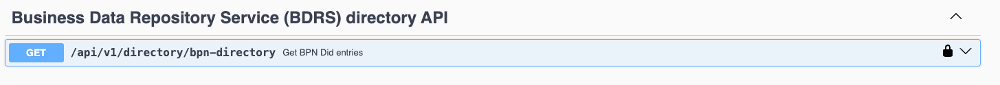

This API will give BPN Did mapping of all wallets available in the application. ``bpn`` request param is optional, user can pass comma separated BPN number. In this case it will return only requested BPN Did mapping and wallet will be created runtime if not created.

We need to pass VP of membership VC in form of JWT in authorization header. This VP must be generated using wallet stub application using query presentation API else token validation will not work, and it will give http status 401.

Response Body:

200 OK


```json
{
  "BPNL000000000003": "did:web:localhost:BPNL000000000003",
  "BPNL000000000002": "did:web:localhost:BPNL000000000002",
  "BPNL000000000001": "did:web:localhost:BPNL000000000001",
  "BPNL000000000000": "did:web:localhost:BPNL000000000000"
}
```


### GET Status List - General


This API returns the VC Status List related to a BPN. For stub purposes, the VC Status List is static and its state
cannot be changed. The statusListVcId is set in the `application.yaml` file in ssi-issuer-component app

Request Parameter:

```
"bpn": "string"
"vcId": "string"
```

Response Body:

```json
{
    "credentialSubject": {
        "statusPurpose": "revocation",
        "type": "StatusList2021Credential",
        "encodedList": "H4sIAAAAAAAA/+3BAQ0AAADCoErvn87NHEABAAAAAAAAAAAAAAAAAAAAAAAAAAAAAAAAAAAAAAAAAAAAAAAAAAAAAAAAAAAAAAAAAAAAAAAAAAAAAAAAAAAAAAAAAAAAAAAAAAAAAAAAAAAAAAAAAAAAAAAAAAAAAAAAAAAAAAAAAAAAAAAAAAAAAAAAAAAAAAAAAAAAAAAA3AD/hHvP//8BAA=="
    },
    "issuanceDate": "2024-07-01T05:03:16Z",
    "id": "did:web:localhost:BPNL000000000000#8a6c7486-1e1f-4555-bdd2-1a178182651e",
    "type": [
        "VerifiableCredential",
        "StatusList2021Credential"
    ],
    "@context": [
        "https://www.w3.org/2018/credentials/v1",
        "https://w3id.org/catenax/credentials/v1.0.0"
    ],
    "issuer": "did:web:localhost:BPNL000000000000",
    "expirationDate": "2025-07-01T05:03:16Z"
}
```

### GET DID Document - General


This API returns the DID document related to a BPNL.

Request Parameter:

```
"bpn": "string"
````

Response Body:

```json
{
    "service": [
        {
            "id": "https://localhost#credential-service",
            "type": "CredentialService",
            "serviceEndpoint": "https://localhost/api"
        }
    ],
    "verificationMethod": [
        {
            "id": "did:web:localhost:BPNL000000000000#c3932ff5-8da4-3de9-a942-62125f394e41",
            "type": "JsonWebKey2020",
            "controller": "did:web:localhost:BPNL000000000000",
            "publicKeyJwk": {
                "kty": "EC",
                "use": "sig",
                "crv": "secp256k1",
                "x": "NytYgtL_rte4EIXpb46e7pntJiPjH4l_pN1j1PVxkO8",
                "y": "99JkYiCOkBfb8qCncv_YWdHy3eZGAQojWbmaEDFwSlU"
            }
        }
    ],
    "authentication": [
        "did:web:localhost:BPNL000000000000#c3932ff5-8da4-3de9-a942-62125f394e41"
    ],
    "id": "did:web:localhost:BPNL000000000000",
    "@context": [
        "https://www.w3.org/ns/did/v1",
        "https://w3c.github.io/vc-jws-2020/contexts/v1",
        "https://w3id.org/did-resolution/v1"
    ]
}
```

# **Architecture Decisions**

## Memory Storage

All the data generated during the interaction with Wallet Stub is only used in runtime. The data is kept in memory
during the lifetime of the application.

### **Runtime Scenarios**

* During initialization of Wallet Stub, a wallet is automatic created by calling the RestAPI api/dim/setup-dim. All the
  initial setup can be done via configuration file.

* The VCs are signed at runtime for test purposes

i.e:

```
#application.yaml
stub:
env: ${STUB_ENV:local}
baseWalletBPN: ${BASE_WALLET_BPN:BPNL000000000000}
clientId: ${CLIENT_ID:clientId}
clientSecret: ${CLIENT_SECRET:secret}
stubHost: ${STUB_HOST:localhost}
stubUrl: ${STUB_URL:https://localhost}
portalWaitTime: ${PORTAL_WAIT_TIME:1000}
statusListVcId: ${STATUS_LIST_VC_ID:8a6c7486-1e1f-4555-bdd2-1a178182651e}
```

* To refresh the memory storage the Wallet Stub service must be restarted.

### **Development Process**

Creation of a new repository for Wallet Stub service.

**Testing:**

1. Unit/integration test using Spring boot test framework with more than 80% code coverage

2. New test cases/modifications in existing test cases in the Wallet stub service

**API testing:**

* API integration testing will be done using Swagger OpenAPI or Postman

## High-level Sequence Diagrams

The following sequence diagrams depicts the interactions between services with wallet dependencies and the wallet stub.
The blue arrows represent wallet endpoints. The red arrows represent the wallet app will call API to another service.

### Portal / Issuer Component / BDRS / Wallet Interactions

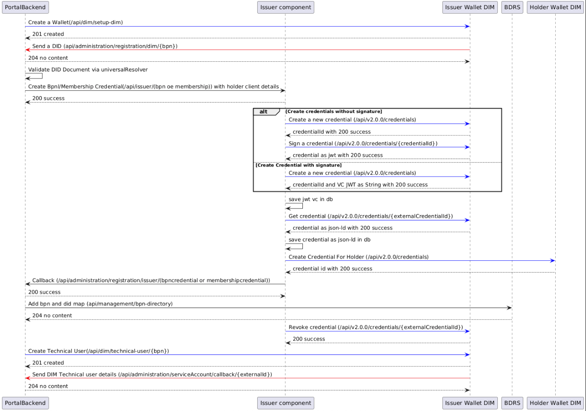

<details>
  <summary>Plant UML</summary>

  ```plantuml
@startuml
participant PortalBackend
participant Issuer as "Issuer component"
participant DIM as "Issuer Wallet DIM"
participant BDRS
participant HW as "Holder Wallet DIM"

PortalBackend -[#blue]> DIM: Create a Wallet(/api/dim/setup-dim)
PortalBackend <-- DIM: 201 created
DIM -[#red]> PortalBackend: Send a DID (api/administration/registration/dim/{bpn})
DIM <-- PortalBackend: 204 no content

PortalBackend -> PortalBackend: Validate DID Document via universalResolver

PortalBackend -> Issuer: Create Bpnl/Membership Credential(/api/issuer/(bpn oe membership)) with holder client details
PortalBackend <-- Issuer: 200 success

Issuer -[#blue]> DIM: Create a new credential (/api/v2.0.0/credentials)
Issuer <-- DIM: credentialId with 200 success

Issuer -[#blue]> DIM: Sign a credential (/api/v2.0.0/credentials/{credentialId})
Issuer <-- DIM: credential as jwt with 200 success
Issuer -> Issuer: save jwt vc in db

Issuer -[#blue]> DIM: Get credential (/api/v2.0.0/credentials/{externalCredentialId})
Issuer <-- DIM: credential as json-ld with 200 success
Issuer -> Issuer: save credential as json-ld in db

Issuer -[#blue]> HW: Create Credential For Holder (/api/v2.0.0/credentials)
Issuer <-- HW: credential id with 200 success

Issuer -> PortalBackend: Callback (/api/administration/registration/issuer/(bpncredential or membershipcredential))
Issuer <-- PortalBackend: 200 success

PortalBackend -> BDRS: Add bpn and did map (api/management/bpn-directory)
PortalBackend <-- BDRS: 204 no content

Issuer -[#blue]> DIM: Revoke credential (/api/v2.0.0/credentials/{externalCredentialId})
Issuer <-- DIM: 200 success

PortalBackend -[#blue]> DIM: Create Technical User(/api/dim/technical-user/{bpn})
PortalBackend <-- DIM: 201 created
DIM -[#red]> PortalBackend: Send DIM Technical user details (/api/administration/serviceAccount/callback/{externalId})
DIM <-- PortalBackend: 204 no content

@enduml

```

</details>

### EDC / BDRS / Wallet Interactions

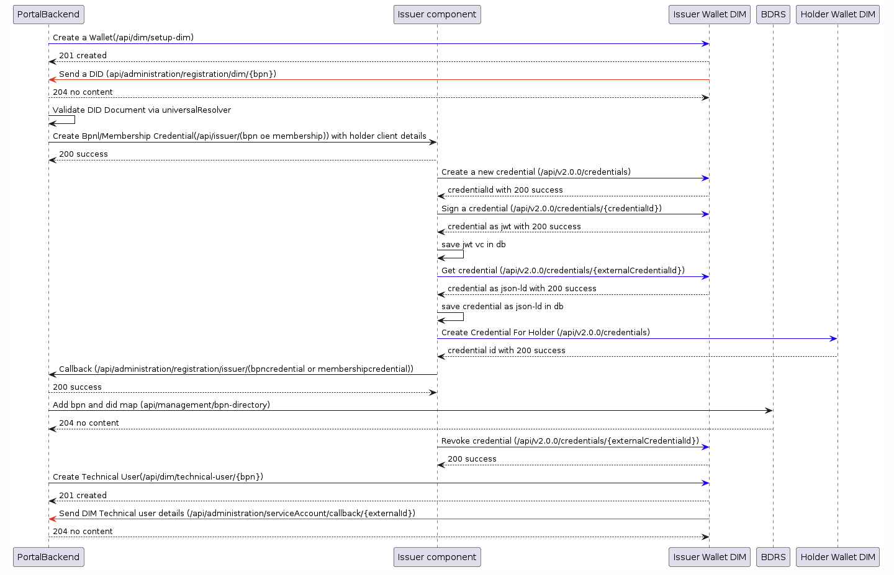

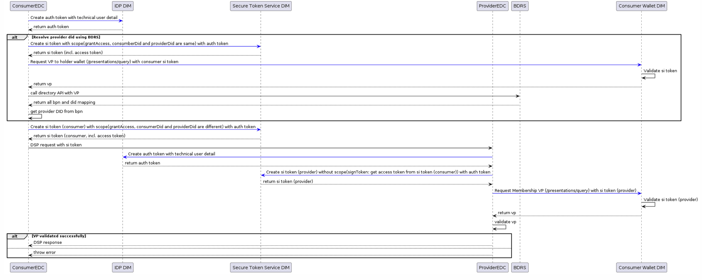

<details>
  <summary>Plant UML</summary>

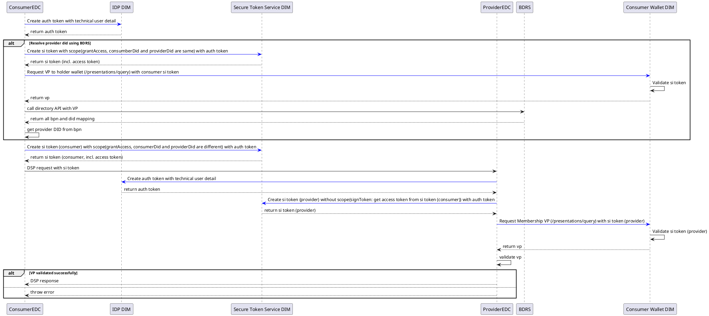

</details>

# **Sequence Diagram**

This API is present in the Wallet Stub

**Endpoint: /api/dim/**

## Portal

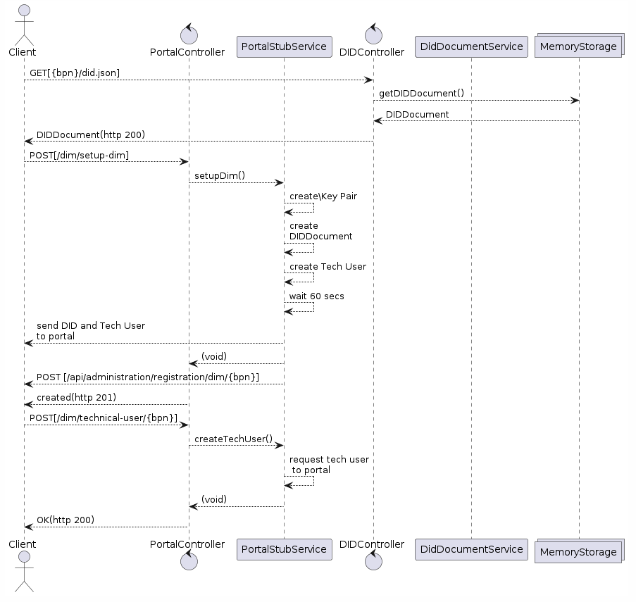
<details>
  <summary>Plant UML</summary>

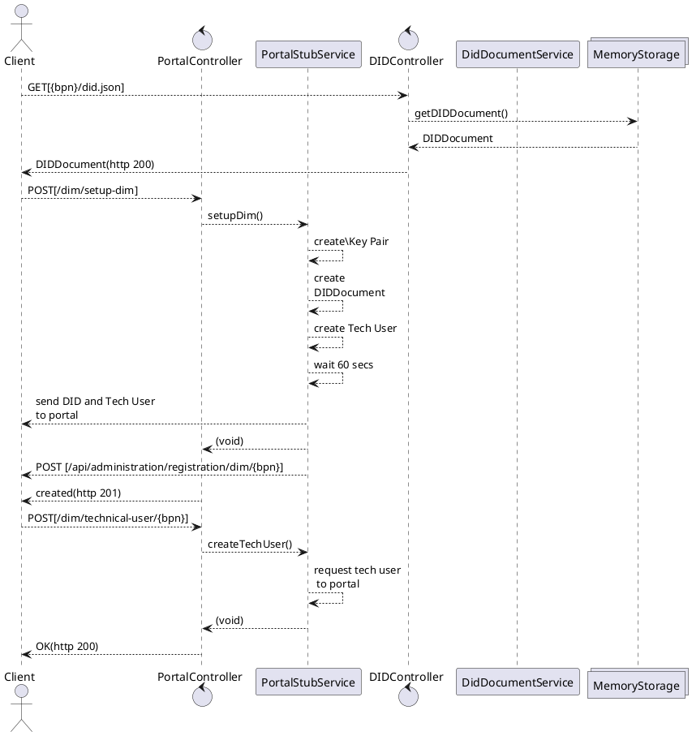

</details>

## Credential Issuer

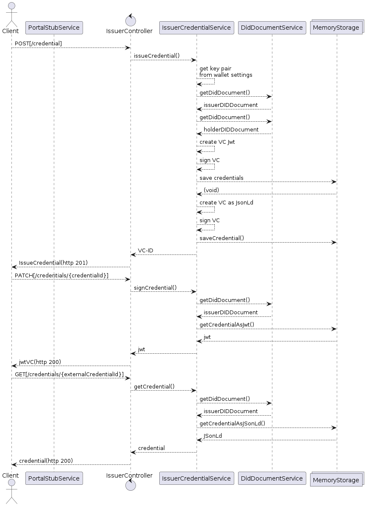
<details>
  <summary>Plant UML</summary>

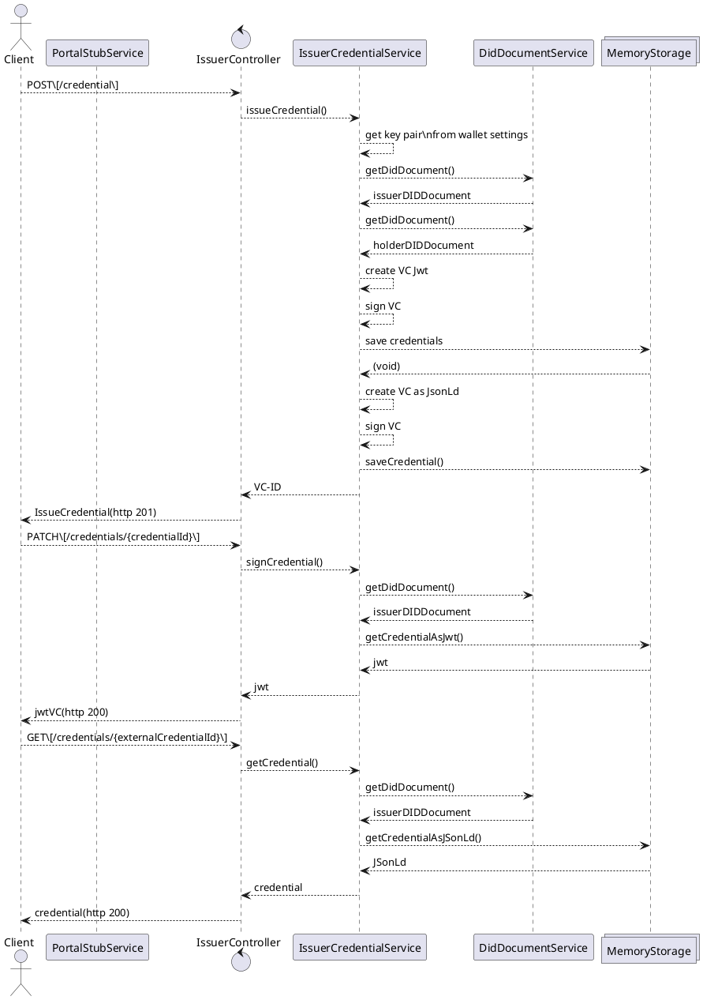

</details>

## EDC - STS

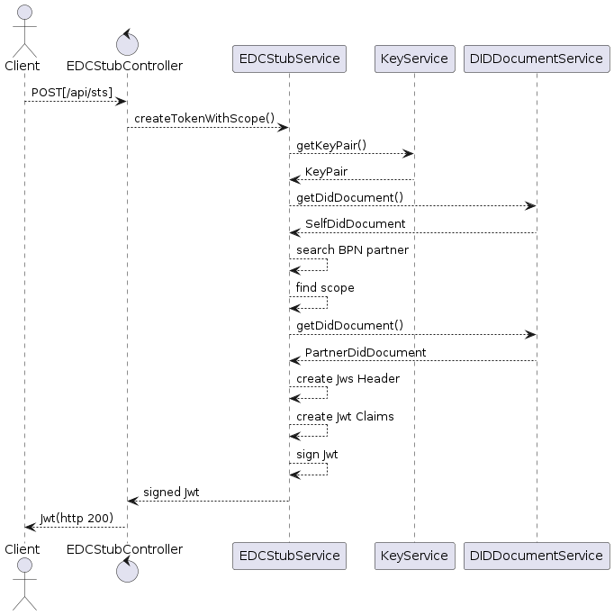
<details>
  <summary>Plant UML</summary>

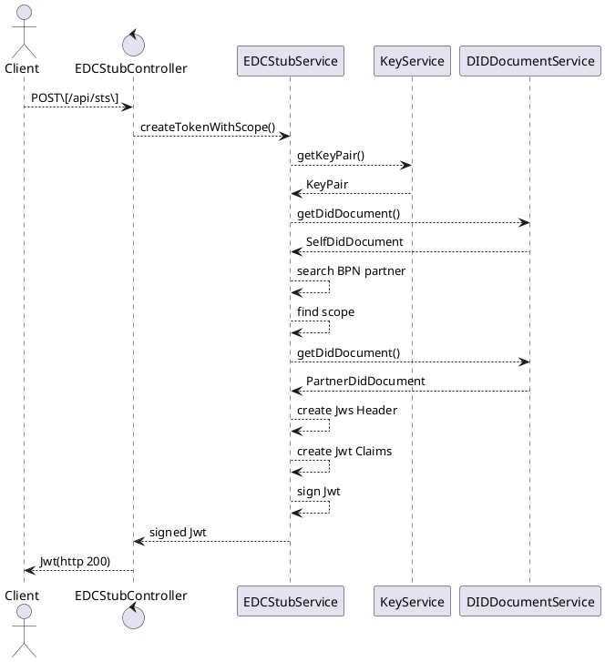

</details>

## EDC - Query Presentations

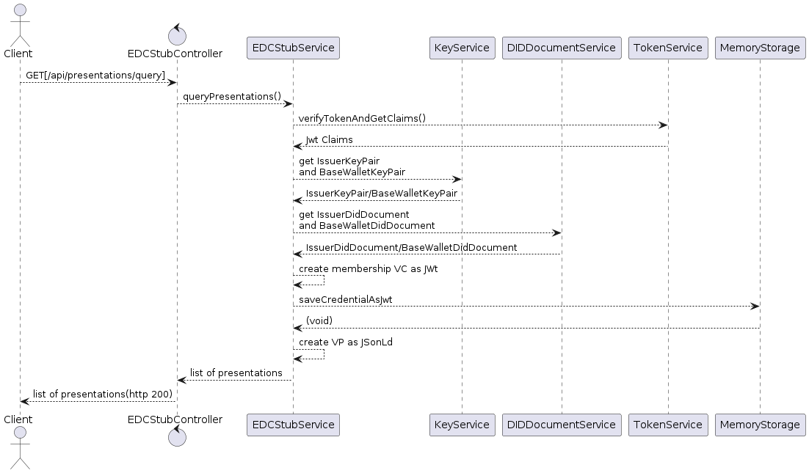
<details>
  <summary>Plant UML</summary>

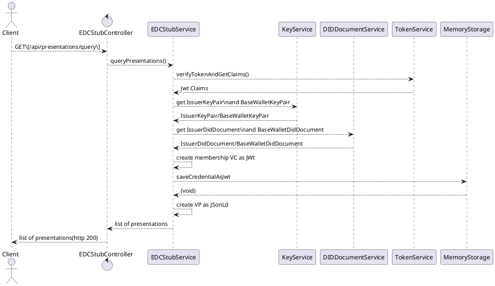

</details>

## Token Generation

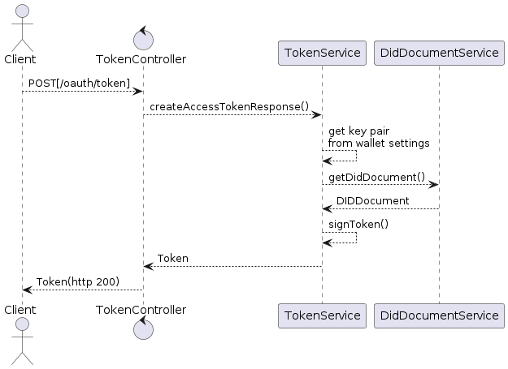
<details>
  <summary>Plant UML</summary>

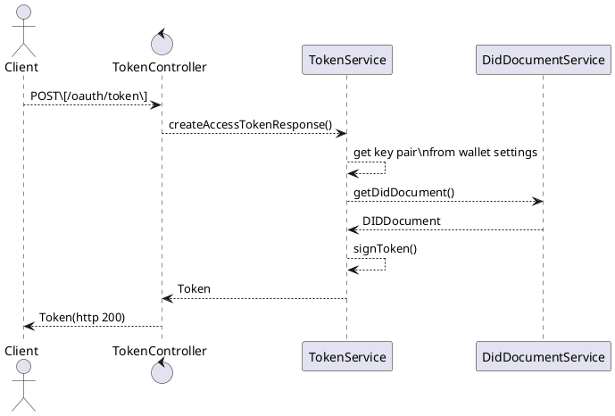

</details>

## Status List


<details>
  <summary>Plant UML</summary>

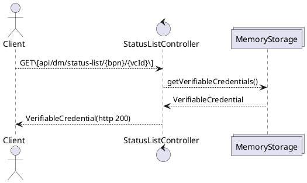

</details>

## **Risks and Technical Debts**

### Risks:

* Data loss in case the wallet stub service is restarted

* The usage of the wallet stub resources does not guarantee that clients are 100% compatible to a real world wallet
  implementation

* During integration with wallet stub service, not all test case scenarios are possible to simulate

### Technical Debts and Limitations

* **Lack of Realistic Behavior / Missing Functionalities:** The wallet stub service provides happy case responses to the
  services with dependencies. Furthermore, stub service comes with a static StatusListVC, meaning no credential can be
  truly revoked.

* **Maintenance Overhead:** As the real services evolve (i.e., SAP DIM but also services with wallet dependency) the
  stub service needs to be updated to reflect these changes.

* **Incomplete Test Coverage:** The wallet stub service does not cover the unhappy cases and error scenarios that the
  real wallet would encounter. This leaves gaps in test coverage, allowing potential bugs to go unnoticed until later
  stages.

* **Integration Issues:** We do not have in-depth knowledge of the SAP DIM wallet or any other wallet that will be the
  real wallet service. Dependencies on wallet stub can mask integration issues that only become apparent when the actual
  wallet service is there.

* **AuthN / AuthZ:** Currently wallet stub service relies on attribute-based JWT for authentication and authorization.
  The clientID and clientSecret are BPN, potentially causing security vulnerabilities.

* **Delayed Real Service Integration:** Over-reliance on wallet stub service can delay the integration with the real
  wallet service. The longer the delay, the higher the risk of integration problems and greater potential for technical
  debt accumulation.

# Glossary/Definitions

| **Term** | **definition**                    |
|----------|-----------------------------------|
| EDC      | Eclipse Dataspace Components      |
| VC       | Verifiable Credential             |
| VP       | Verifiable Presentation           |
| UC       | User Case                         |
| BPN      | Business Partner Number           |
| DID      | Decentralized identification      |
| E2E      | End to End                        |
| DIM      | Decentralized Identity Management |


## NOTICE

This work is licensed under the [Apache-2.0](https://www.apache.org/licenses/LICENSE-2.0).

- SPDX-License-Identifier: Apache-2.0
- SPDX-FileCopyrightText: 2024 Contributors to the Eclipse Foundation
- Source URL: https://github.com/eclipse-tractusx/ssi-dim-wallet-stub
